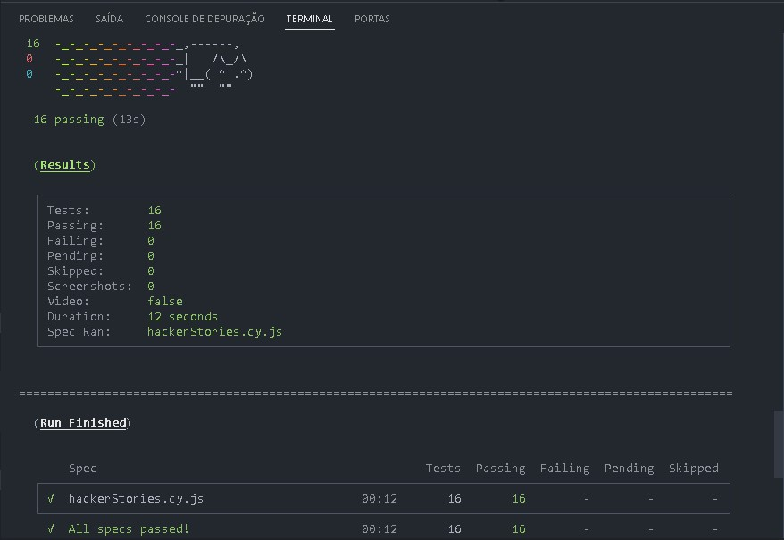

# Testes Automatizados com Cypress - Avançado

👋 Hello bem vindo(a) ao meu repositório de testes com Cypress! ❤️

  

### Nesse curso aprendi muitos comandos que eu não conhecia, e como deixar meus testes mais robustos, e é claro já o fiz com a versão mais recente do cypress que no momento é a versão `13.3`.

### Veja o que aprendi:

- Como criar testes 100% _flakiness-free_
- Como interagir com a aplicação o mais próximo de como um usuário real faria
  - Como esperar por um elemento estar visível antes de interagir com ele
  - Como simular o uso do teclado em vez de clique em botão em funcionalidades de busca
  - Como esperar por requisições HTTP antes de seguir em frente com os testes
- Como organizar diferentes testes em seus específicos contextos
- Como ler o `localStorage` do navegador
- Como tornar seletores de elementos mais específicos
- Como simplificar comandos repetitivos
- Como interceptar e mockar uma API externa para testar o frontend independente do backend
- Como simular erros no servidor e na rede
- Como simular lentidão na chamada à uma API
- Como modificar o relatório de testes padrão para um que combine com o seu estilo 😉

## Se deseja baixar meu código e ver os testes passando, segue as dependências que vai precisar baixar:

Vá para a seção de [pré-requisitos](./cypress/images/preRequisitos.md).

___

Esse foi mais um curso que fiz do embaixador do cypress `Walmyr Filho` da [**Escola Talking About Testing**](https://udemy.com/user/walmyr).